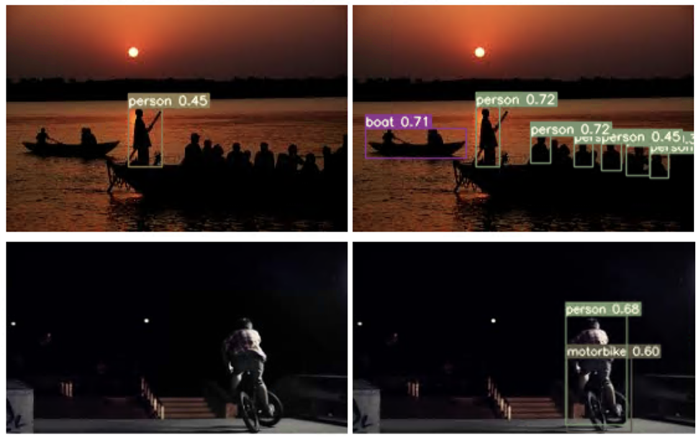
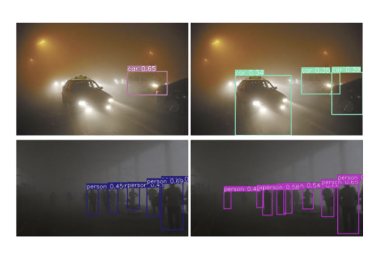

This repo contains the code for the WACV 2025 Paper, [WARLearn: Weather Adaptive Representation Learning](https://openaccess.thecvf.com/content/WACV2025/papers/Agarwal_WARLearn_Weather-Adaptive_Representation_Learning_WACV_2025_paper.pdf).


# WARLearn

The WARLearn code was developed on a Linux machine with an NVIDIA TITAN RTX 24GB GPU.

## Replicating the WARLearn Experiment

To replicate the WARLearn experiment, follow these steps:

1. Create a conda environment with Python 3.10.
   
    ```bash
    conda create -n warlearn_env python=3.10
    conda activate warlearn_env
    ```

2. Install the required packages using pip.

    ```bash
    pip install -r requirements.txt
    pip install tensorboard
    ```

### Datasets

- Pascal VOC: [http://host.robots.ox.ac.uk/pascal/VOC/](http://host.robots.ox.ac.uk/pascal/VOC/)
- RTTS: [https://sites.google.com/view/reside-dehaze-datasets/reside-%CE%B2](https://sites.google.com/view/reside-dehaze-datasets/reside-%CE%B2)
- ExDark: [https://github.com/cs-chan/Exclusively-Dark-Image-Dataset/tree/master/Dataset](https://github.com/cs-chan/Exclusively-Dark-Image-Dataset/tree/master/Dataset)

### Code References

The WARLearn code is built on top of the YOLOv3 code from [Lornatang/YOLOv3-PyTorch](https://github.com/Lornatang/YOLOv3-PyTorch).

We also utilized the simulation code from Image-Adaptive-YOLO [wenyyu/Image-Adaptive-YOLO](https://github.com/wenyyu/Image-Adaptive-YOLO) to run adverse weather baseline experiments.

### Training

1. Download the Pascal VOC dataset and place it in the following structure:

    ```plaintext
    VOC0712
    ├── test
    |    └──VOCdevkit
    |        └──VOC2007 (VOCtest_06-Nov-2007.tar)
    └── train
         └──VOCdevkit
             └──VOC2007 (VOCtrainval_06-Nov-2007.tar)
             └──VOC2012 (VOCtrainval_11-May-2012.tar)
    ```

2. Use `scripts/voc_annotation.py` to reformat the dataset.
3. Run the `train.py` script to train the model on clear weather data. We trained the clean data model for 600 epochs.
4. Store the feature vectors obtained from the backbone for each image in the training dataset into a dictionary and save it in "train_latent_dict.pickle". This can be done running the `test.py` script on the training data. Check commented lines 133-136 and 217-218 in `test.py`.

Run the adverse weather simulating scripts, (e.g., `scripts/data_make_foggy.py`) to generate synthetic foggy adverse weather training and test datasets from Pascal VOC training and test data respectively. Use `train_adverse.py` to fine-tune the YOLO clean model backbone for foggy weather. The fine-tuning was done for 10 epochs.

Similarly, generate low-light data using `scripts/data_make_lowlight.py` and then utilize `train_adverse.py` to fine-tune the YOLO clean model backbone for low-light weather conditions. The fine-tuning was done for 10 epochs.

Please refer to the paper for more details about the training parameters setup.

### Testing

1. Download RTTS dataset for real-world foggy images and ExDark for real-world low-light images.
2. Get the test samples from these datasets in the required format using the corresponding scripts in the `scripts` folder.
3. Modify the `test` path in `data/voc.data` to your test data list path.
4. Modify the `WEIGHTS_PATH` in `configs/test/YOLOV3_VOC.yaml` to the model `.pth.tar` path.
5. Run `test.py` to get the results for mAP@50(%).

### Results

Our Framework achieved SOTA performance on both real world foggy (RTTS) and lowlight datasets (ExDark).
Following is a visualization of object detection performance comparison on lowlight and foggy conditions using vanila YOLOv3 and WARLean. Clearly WARLearn is able to detect more objects and with higher confidence.

#### Results on Low-Light Weather Condition



| Framework | Training Data | Clean | SimLowLight | ExDark |
| :------------ |:---------------:| :------------ |:---------------:| :------------ |
| YOLOv3 | Pascal VOC clean | 76.30 | 59.90 | 49.30 |
| YOLOv3 | Pascal VOC lowlight mixed | 70.20 | 67.60 | 49.90 |
| ZeroDCE + YOLOv3 | Pascal VOC clean | -- | 63.10 | 48.10 |
| IA-YOLO | Pascal VOC lowlight mixed | 72.34 | 63.38 | 48.16 |
| ZeroDCE + WARLearn | Pascal VOC lowlight mixed | -- | 67.00 | 51.30 |
| FeatEnhancer | Pascal VOC lowlight mixed | -- | 68.20 | 53.70 |
| WARLearn | Pascal VOC lowlight mixed | 75.50 | 70.90 | 55.70 |

#### Results on Foggy Weather Condition



| Framework | Training Data | Clean | SimFoggy | RTTS |
| :------------ |:---------------:| :------------ |:---------------:| :------------ |
| YOLOv3 | Pascal VOC clean | 76.30 | 53.61 | 46.20 |
| YOLOv3 | Pascal VOC foggy mixed | 66.80 | 71.20 | 49.00 |
| C2PNet + YOLOv3 | Pascal VOC clean | -- | 66.50 | 47.70 |
| IA-YOLO | Pascal VOC foggy mixed | 69.38 | 67.58 | 47.68 |
| C2PNet + WARLearn | Pascal VOC foggy mixed | -- | 69.30 | 52.00 |
| WARLearn | Pascal VOC foggy mixed | 69.11 | 75.10| 52.60 |

### Pre-trained Models
| Training Data | Best Model |
| :------------ |:---------------:|
| Pascal VOC clean | [best_clean.pt](https://drive.google.com/file/d/1elz_4GNgVmNTcLH6ZPnBLP2m4ccfpOxk/view?usp=drive_link)   |
| Pascal VOC foggy mixed | [best_foggy_mixed.pt](https://drive.google.com/file/d/1RrpH5DGIoEbPYN2N1lGm6m8yICIWK7nS/view?usp=drive_link)|
| Pascal VOC lowlight mixed | [best_lowlight_mixed.pt](https://drive.google.com/file/d/19WcchNZixlmeTdtisSE61HvhAkSxUjjq/view?usp=drive_link)    |

## Citation

```bibtex
@InProceedings{Agarwal_2025_WACV,
    author    = {Agarwal, Shubham and Birman, Raz and Hadar, Ofer},
    title     = {WARLearn: Weather-Adaptive Representation Learning},
    booktitle = {Proceedings of the IEEE/CVF Winter Conference on Applications of Computer Vision (WACV)},
    month     = {February},
    year      = {2025},
    pages     = {4978-4987}
}
```
